## Introduction

Artificial Intelligence has taken giant leaps in tech-space, however that has been the case for well ... decades now.

Garry Kasparov, who I hope needs no introduction, was practically the Great Wall of China when it came to defending his world chess champion title, no one could beat him in his prime well...

... that was till [Deep Blue in 1997](https://www.chess.com/article/view/deep-blue-kasparov-chess) did the unthinkable and was able to beat Garry after a series of matches finally ending up victorious with the scoreline being 3.5 to 2.5.

Now even Deep-Blue has been surpassed by the elder brother of [Bobby Fischer](https://github.com/official-stockfish) which is about 3750 elo which means even if this bot was down a queen/rook or even both against legendary GM's like Magnus Carlsen or Vishy, there is **STILL** no chance for them to win, even with the best human efforts you can at most secure a draw.

If you ever had the misfortune to stumble across live-object tracking posts which is just [YOLO](https://docs.ultralytics.com/) inference most of the times, which at it's heart is a principled neural-network combining fundamental OpenCV techniques & provides clean reusable templates to check weights & biases efficiently. Most importantly, it is extremely simple to use making it the top choice for autonomous-robotics, which is ... also why you see 15k object-tracking posts on linkedin cause literally it takes about 2s to instantiate a use-case.

<figure class="my-6 flex flex-col items-center">
  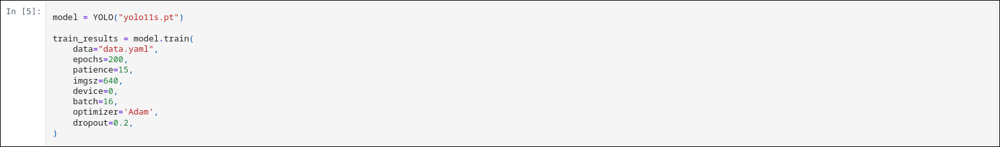
  <figcaption class="mt-2 text-center text-sm text-gray-500 italic dark:text-gray-400">
    yea I'm being{' '}
    <a
      href="https://github.com/PranavU-Coder/tumour_detection/blob/main/tumour.ipynb"
      target="_blank"
      rel="noopener noreferrer"
      class="underline"
    >
      serious
    </a>
  </figcaption>
</figure>

Now the purpose of this post is not to deconstruct the very essence of alpha-beta pruning or CNN's as a whole but to explore the very fundamental idea of how exactly data can help drive these bots to be super-specialized in their tasks, and maybe even far superior in humans at many cases.

So without wasting any more of your precious time nor attention, let's proceed to emphasize on the very title of this post: _ENTROPY_

## Inspiration

So this post is massively inspired by [3b1b's video of entropy and it's use to determine best opener for wordle](https://www.youtube.com/watch?v=v68zYyaEmEA) and my personal reading for Information Theory as a branch of Mathematics for my own research-work & I do intend to continue finding more practical applications of these concepts with each step in my journey here.

Do consider watching the video if you think this post was interesting in any sorts! Also there is a comment-section to my posts now so feel free to leave your thoughts below.

## Origins

So Entropy as a term itself was first introduced in physics/chemistry [more specifically in "thermodynamics", the domain of phy/chem purely comes down usually to how you define work being done by/against a body but nevertheless that's besides the point] put forward by esteemed scientist: "Rudolf Clausius"

It quantifies the amount of energy in a system that is unavailable for doing work and reflects the degree of disorder in that system, if you didn't understand anything from that statement just think of entropy as an idea to visualize & quantify "randomness" in any particular physical system, which can actually help you to understand when this concept is forwarded to mathematics.

It was Boltzmann who was able to put forward this in the mathematical equation:

$$
S = k_B \ln(\Omega)
$$

And you can tell how much that meant to Boltzmann and the community of science so much so this equation is inscribed in his grave

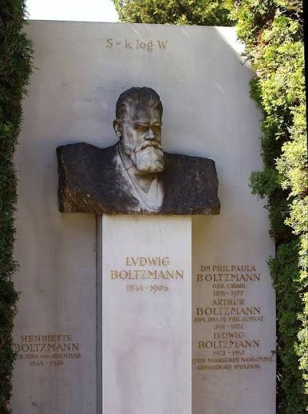

Anyways entropy wasn't really a mathematical concept **UNTIL** Claude Shannon put forward it in 1948.

Now the mathematical definition of entropy is a bit different from the thermodynamic definition of entropy, so mathematically entropy is nothing more than a quantitative measure of "uncertainty/randomness" within a probability distribution.

To simplify all this in very layman terms, I will pull out the old [Numberphile joke](https://youtu.be/b6VdGHSV6qg?t=57) to explain this

Let's assume the most basic setup in existence, tossing a fair coin, now if I asked you how surprised would you be if the flipped coin landed on heads?

if you said "maybe, a bit?"

well congratulations, you are correct because it is _indeed_ exactly one **bit**!

... If you are confused, let me clear that air of mystery real quick:

$H(X) = -\sum_{i=1}^{n} P(x_i) \log_b P(x_i)$

Now you may say, the above equation didn't clear it at all, well let me break it down what it means exactly:

H(X) is measured as the entropy of a given discrete random variable 'X' and so if you look at the formula again, H(X) is nothing more than the summation of all probabilities alongside with product of their logarithms

Now this summation might seem unintuitive since there is a minus sign ahead and obviously probability of any variable can never be < 0 but that is because of how logarithm takes in multiplication and division operations in account so don't worry on that front

$H(X) = \sum_{i=1}^{n} P(x_i) \log_b \left(\frac{1}{P(x_i)}\right)$

This is equally valid and this equation gives us the Shannon-Entropy equation which also forms the entire basis of Information Theory!

Again if we recall the definition of entropy, entropy tells us how "uncertain" we are about particular events or the possibility of us being shocked at a particular even happening, generally when we are computing entropy, we calculate logarithms with base 2

Now you may ask, why exactly 2? well ... log base 2 helps us in getting **binary q/a**

Again hopefully I may not have to explain what binary is and I will proceed with the coin flip experiment and compute for better understanding:

$$
\begin{aligned}
H(X) &= -\sum_{x \in \{H, T\}} P(x) \log_2 P(x) \\[6pt]
&= -\left[ P(\text{Heads}) \log_2 P(\text{Heads}) + P(\text{Tails}) \log_2 P(\text{Tails}) \right] \\[6pt]
&= -\left[ \frac{1}{2} \log_2\left(\frac{1}{2}\right) + \frac{1}{2} \log_2\left(\frac{1}{2}\right) \right] \\[6pt]
&= -\left[ \frac{1}{2}(-1) + \frac{1}{2}(-1) \right] \\[6pt]
&= -[-1] = 1 \text{ bit}
\end{aligned}
$$

So I hope the lame joke of "1 bit" thrown up a while ago, made some sense but what does this signify?

When we say, entropy of a particular event is 1 bit it implies that there is generally one binary outcome of this very event, which can also be reframed as amt of binary questions that could be asked for a particular event X which here for us is the uncertainity of getting heads in a fair coin-flip

So when we now consider the uncertainity for getting a head when when we take the same coin being flipped twice (independently, we are not flipping two coins at once):

The entropy if you will calculate it will be 2 bits => so 4 possible outcomes can arise from two possible binary questions

well simply put:

**Q1:** _"Was the first flip Heads?"_ (cuts 4 possibilities in half).

**Q2:** _"Was the second flip Heads?"_ (cuts the remaining 2 possibilities down to the exact 1).

I hope the intuition is somewhat clear and if you may wonder, what if the entropy is fractional? so for example if we take another extremely overused and basic experimental setup of rolling a fair die and asking how uncertain/surprised we would be if we were to roll a 6?

Well, again if we were to calculate it, it comes out to be 2.585, and the valid question is how the hell are you supposed to ask 0.585 amount of binary questions

And don't worry my friend, we can't ... because bits generally signify the minimum amount of optimal binary questions that can be asked so theoretically you would have to ask three questions here for arriving at a conclusion

A better way to think in such instances for about 1000 dice rolls, we can optimally ask 2585 binary questions to arrive at our conclusion

## Hangman

Now with the intuition of entropy understood, we will try to attempt building an optimal guesser for the [hangman-challenge](https://hangmanwordgame.com/?__cf_chl_f_tk=.vZmpPd.8XeiZML6JKgqNV7FTcZkjMofUnD44lkX2Eo-1783235196-1.0.1.1-T7qPlOHCPUjiCOBUPssOB8ZDBPlPuq7jxeSTKJATyHo&fca=1&success=0) which is very similar to the wordle challenge that 3b1b had attempted **HOWEVER** unlike 3b1b's wordle challenge, hangman doesn't really restrict itself to a set of 5-letters like wordle would

So lets tackle this systematically:

If we were to lets say guess a 10 letter word, we have to first ask ourselves is the word a valid human-readable word of any gibberish that can be formed via a set of repeating letters in the alphabet-series

Because if the latter is true then the possibilities of numbers of words is about 26 raised to the power of 10 and not only is that beyond the reach of most processor's capability but even human's can't decode it if they give themselves a lifetime

Fortunately though, hangman follows the same convention of dictionary words meanwhile also giving signals to which letters actually exist in the guessing word making it a lot easier

so in this setup, if we know we have to guess a 10-letter word, then our number of possible outcomes/words that can arise would be roughly around [25,028 words](https://en.wikipedia.org/wiki/NASPA_Word_List#:~:text=NWL2023%20words%20by%20number%20of,3%2C839) which while is not that amazing is far better than the trillions that arise from the earlier case

Thus if we calculate the uncertainity now: it will be 14.611 bits, now if you have played hangman you will realize that the game ends if you fail after 6 attempts so ... how will we possibly win if the entropy is that high

_BUT_ a higher entropy in the first turn is actually **GOOD** which seems again extremely counter-intuitive like why would I want to increase the uncertainity of what word I want to guess?

Well to understand that we have to recognize how the words in a dictionary usually appear, most words in the english alphabet dictionary don't contain the letter 'Z' which implies the probability of a word containing the Z is very low and thus the entropy is quite low as well AND since that is the case, it might be redundant to use Z as our opener

On the other hand, letters like 'E' and 'A' are so common to occur, so the most optimal guess will be one where we will be maximizing our entropy, again may seem a bit hard to grasp but again there are more words in this blogpost containing vowels than the letter 'Z' if you notice!

So before we do anything else, we can compute the individual frequency of each letter occuring in a n-length word, I am going with [enable1.txt](https://github.com/dolph/dictionary/blob/master/enable1.txt) file as it is generally clean and is used for several programming challenges like this one right here

```c

ch = fgetc(file);
        if (ch == '\n' || ch == '\r' || ch == ' ' || ch == '\t' || ch == EOF) {
            if (current_len == len) {
                total_words++;

                // track unique letters inside this specific word
                int in_this_word[26] = {0};
                for (int i = 0; i < current_len; i++) {
                    char c = current_word[i];
                    if (c >= 'a' && c <= 'z') {
                        in_this_word[c - 'a'] = 1;
                    } else if (c >= 'A' && c <= 'Z') {
                        in_this_word[c - 'A'] = 1;
                    }
                }

                // update the master counter for letters present in this word
                for (int i = 0; i < 26; i++) {
                    if (in_this_word[i]) {
                        letter_word_counts[i]++;
                    }
                }
            }
```

so now the var: letter_word_counts[i] holds the number of n-length words that contain letter i at least once, later p can be considered as the letter_word_counts[i]/total_words and thereby forming the basis of the entropy we are about to calculate

```c
double max_entropy = -1.0;
    char best_letter = ' ';

    for (int i = 0; i < 26; i++) {
        double p = (double)letter_word_counts[i] / total_words;
        double entropy = 0.0;

        // -p*log2(p) - (1-p)*log2(1-p)
        if (p > 0.0 && p < 1.0) {
            double entropy_present = -p * (log(p) / log(2.0)); // present outcome's contribution to the total sum
            double entropy_absent = -(1.0 - p) * (log(1.0 - p) / log(2.0)); // ... contribution to the total sum
            entropy = entropy_present + entropy_absent;
        }
        printf("   %c    | %10d |    %1.4f   |  %1.4f \n", 'a' + i, letter_word_counts[i], p, entropy);

        if (entropy > max_entropy) {
            max_entropy = entropy;
            best_letter = 'a' + i;
        }
    }
    printf("  recommended guess: '%c'\n", best_letter);
    return 0;
}
```

now there is absolutely no need to find the "best letter" like I did here but it is for my ease of convenience of playing this game as optimally as possible, anyways the fundamental concepts are still rooted here in the code as it is observed.

you may ask, ok even if I find the optimal starting letter for let's say a 5-letter word, what now?

it is a valid question to ask, because entropy by itself can't be helpful to solve the entire puzzle on it's own which is where a familiar concept may come across which is "CONDITIONAL ENTROPY" & "MUTUAL INFORMATION", if you have read a bit above basic level of probability I am sure you have definitely heard about conditional probability

$$H(Y|X) = -\sum_{x \in \mathcal{X}} \sum_{y \in \mathcal{Y}} p(x, y) \log_2 p(y|x)$$

Even the definition is analogous which states that "H(X | Y) measures the remaining uncertainty in a random variable Y given that the value of another variable X is known"

Now a new concept that we are taking in account here is "Mutual Information" which states that I (X; Y ) is the reduction in the uncertainty of X due to the knowledge of Y and follows the following expression:

$$I(X; Y) = H(X) - H(X|Y)$$

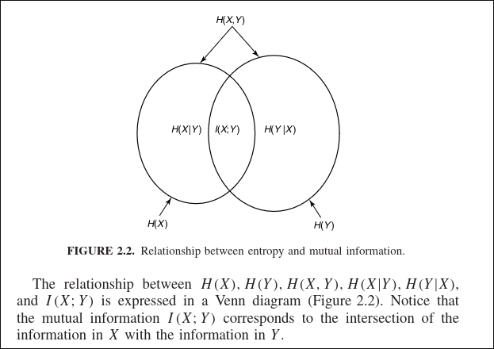

I think this venn-diagram speaks more than any yapping I could possibly do for this concept, ultimately it is the overlapping of the two uncertainities and how if we know a bit about Y, it helps us understand X better

so let us get back to programming:

```c
int matches = 1;

                    // validate dictionary word against the mask rules
                    for (int i = 0; i < len; i++) {
                        char m = mask[i];
                        char w = current_word[i];

                        if (m != '.') {
                            if (w != m) { matches = 0; break; }
                        } else {
                            for (int j = 0; j < len; j++) {
                                char other_m = mask[j];
                                if (other_m != '.' && w == other_m) { matches = 0; break; }
                            }
                            if (!matches) break;
                        }
                    }

                    // validate dictionary word against missed letters
                    if (matches) {
                        for (int i = 0; i < len; i++) {
                            char w = current_word[i];

                            for (int j = 0; j < missed_len; j++) {
                                char m_letter = missed[j];
                                if (w == m_letter) { matches = 0; break; }
                            }
                            if (!matches) break;
                        }
                    }
```

what is mask? well glad you asked, it is just a placeholder for letters we don't know in the word, if the current character in the mask is a known letter we check for if the dictionary word has the exact same letter at that exact position. if it doesn't match, it flags matches = 0 and stops checking the word immediately.

this is to ensure a strict 1:1 relationship for revealed letters. if a letter is known **THEN** it must appear only where it is shown in the mask else no.

also there will be many cases where our guessed word might not appear in the word so we use that as an extra - _bit_ of information to further eliminate possible words that can arise

```c
        // H(X) is the uncertainty before any guessing, over all words of this length.
        // H(X | Y=y) is the uncertainty that's left now that we know the mask & misses.
        // Both are log2(count) because each surviving word is equally likely.
        double H_X          = log((double)all_words)   / log(2.0);
        double H_X_given_Y  = log((double)total_words) / log(2.0);

        double info_gained  = H_X - H_X_given_Y;

        printf("H(X)      = %.4f bits  \n", H_X);
        printf("H(X | Y)  = %.4f bits  \n", H_X_given_Y);
        printf("I(X;Y)    = %.4f bits  \n\n", info_gained);

        printf(" letter | word Count | probability | entropy \n");

        double max_entropy = -1.0;
        char best_letter = ' ';

        for (int i = 0; i < 26; i++) {
            double p = (double)letter_word_counts[i] / total_words;
            double entropy = 0.0;

            if (p > 0.0 && p < 1.0) {
                double entropy_present = -p * (log(p) / log(2.0));
                double entropy_absent = -(1.0 - p) * (log(1.0 - p) / log(2.0));
                entropy = entropy_present + entropy_absent;
            }

            printf("   %c    | %10d |    %1.4f   |  %1.4f \n", 'a' + i, letter_word_counts[i], p, entropy);

            if (entropy > max_entropy) {
                max_entropy = entropy;
                best_letter = 'a' + i;
            }
        }
        if (max_entropy > 0.0) {
            printf("  reccommended next guess: '%c'\n", best_letter);
        } else {
            printf("  reccommended next guess: None\n");
        }
    }
    return 0;
}
```

Not necessary to understand everything in one go and it may be better to finally test whether this bot can actually be able to optimally guess words of any length without me giving any external help

## Experiment

Ok so for this challenge, I am going to continue letting the bot eliminate all possible words and narrow it finally to one word and yea let's see how it performs

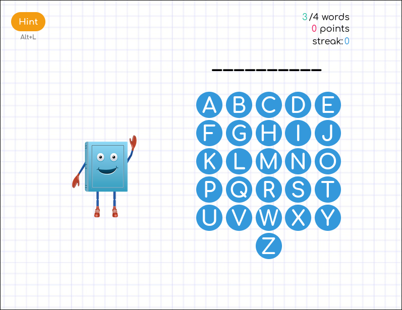

so we are now given a 10 letter word to guess so I will check what is the best-starting letter for any 10-letter word

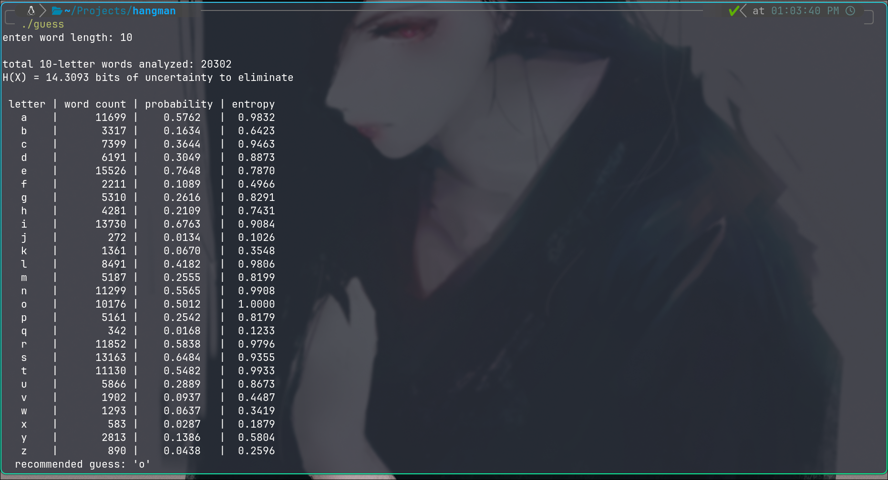

So let's roll with 'O' and check what happens

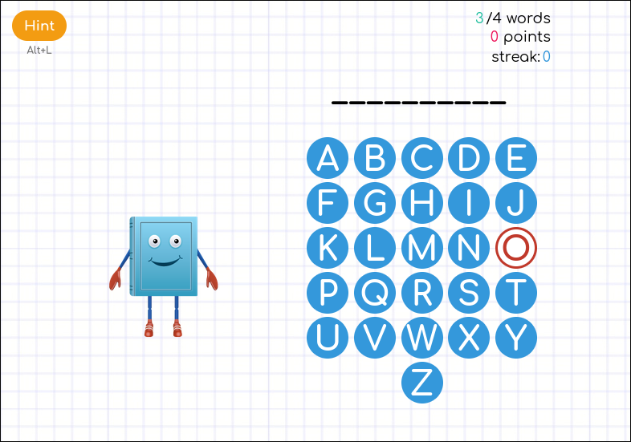

turns out O is not in this word so let's use this new information to now attempt solving this

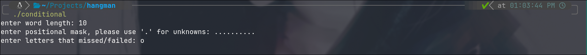

so as you can see here, my input buffer is all dots since I have no idea what the word is and 'O' is clearly not here so it should now eliminate nearly half of all possible words

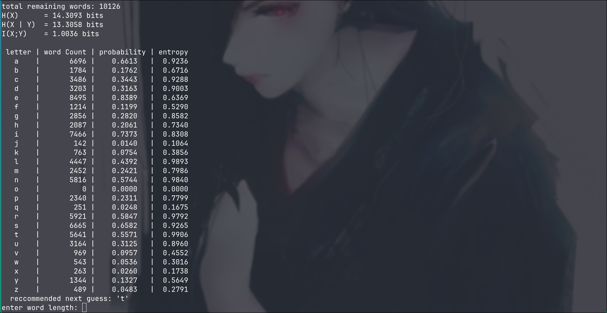

well fortunately for us 'T' was luckily the best guess

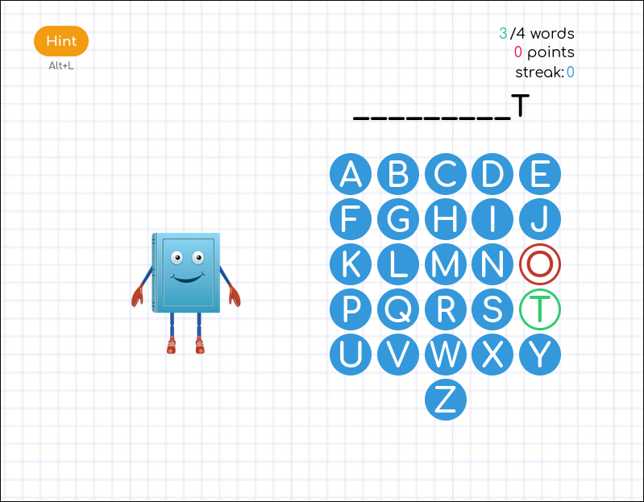

and that correct guess was enough to eliminate almost all the words possible

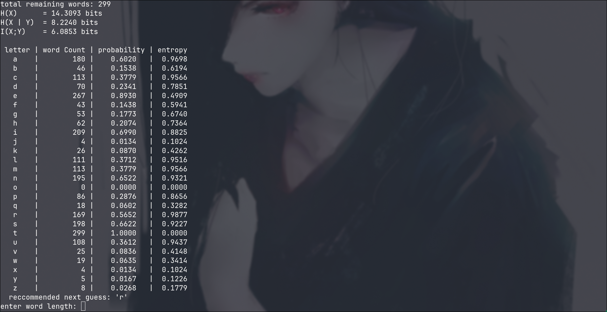

From 10.1k possibilities to 300 in one turn?!? that's lowkey crazy

I am going to skip ahead a few turns and tell you what the outcomes were though:

```
r was not the correct guess, so remaining possibilities is 130 words
reccommended: l, it was correct and we are now in the closing stages
```

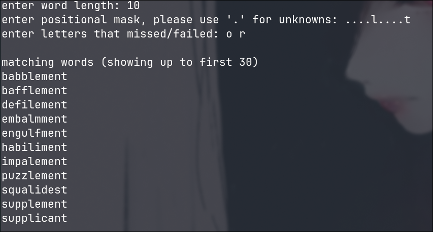
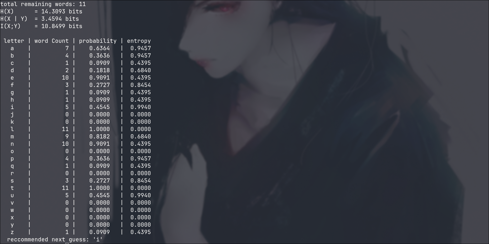

So if I were to ask y'all if you have made it this far in this post if you could guess what the word can knowing l & t exist in those indices and o & r do not appear in the word

Cause I know I don't know jackshit here lol, but yea we have narrowed to 11 possible words, so let's complete the simulation and check what is the word, again we will narrow till the recommended is `None` cause we have then found the word

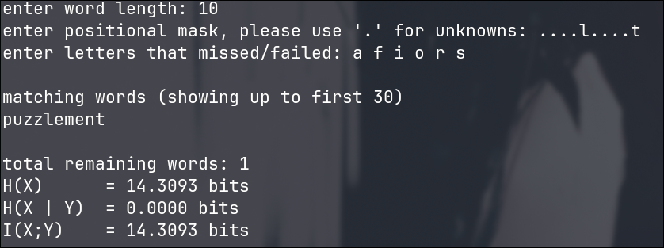

so after couple more unsuccessful guesses, we have maximized our possible information gain as visible so now there can only be one possible word and that is "puzzlement" thankfully we just managed to survive death as we were so close to losing!

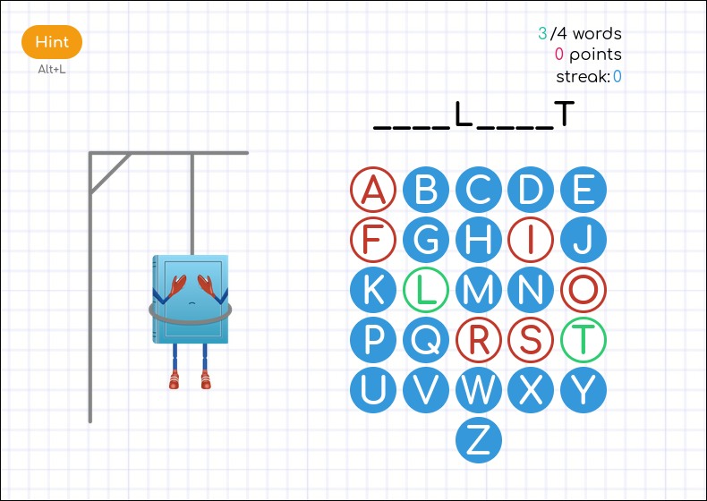

AND ....

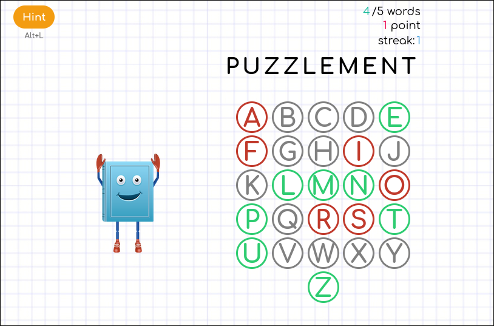

it was indeed the correct word, isn't it fascinating how using such fundamental concepts of mathematics we are able to build such sophisticated guessing-bots, cause I sure am

So now there are other applications of such fundamental concepts especially used in everyday Machine-Learning algorithms and loss-techniques which is primarily why I chose to read these things, you can even use these concepts to build your own [akinator](https://en.akinator.com/) which also runs on these fundamental principles to eliminate possiblities with new information that it recieves.

## Final thoughts

Now this is again in part of a series of blogs [well hoping to convert it in such a manner] of leveraging mathematical-concepts to solve real-life challenges as that is what engineering is all about, all code used in this blog is referenced [here](https://github.com/PranavU-Coder/hangman) with instructions to run for your own sake

Again feel free to let me know your thoughts, if you have made it so far in this blog or just how your day has been!

## References

[Elements of Information Theory](http://staff.ustc.edu.cn/~cgong821/Wiley.Interscience.Elements.of.Information.Theory.Jul.2006.eBook-DDU.pdf)
